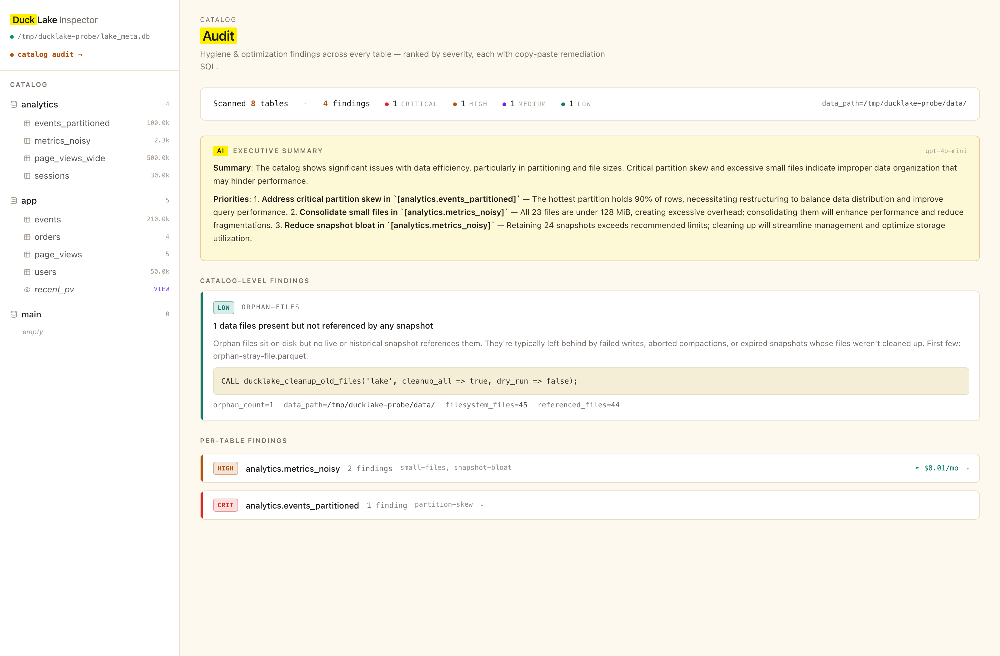
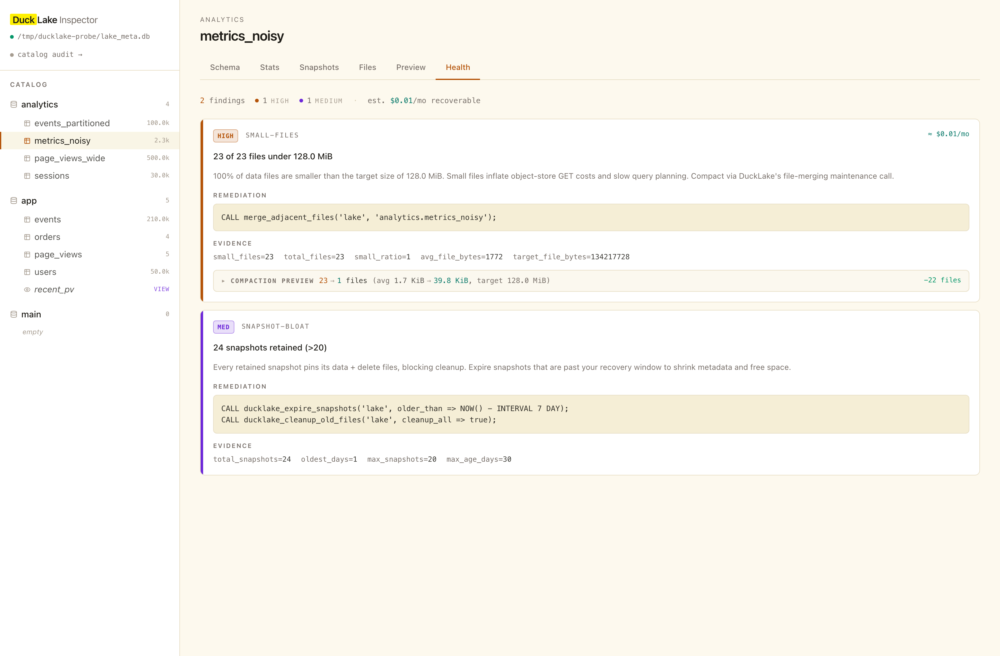
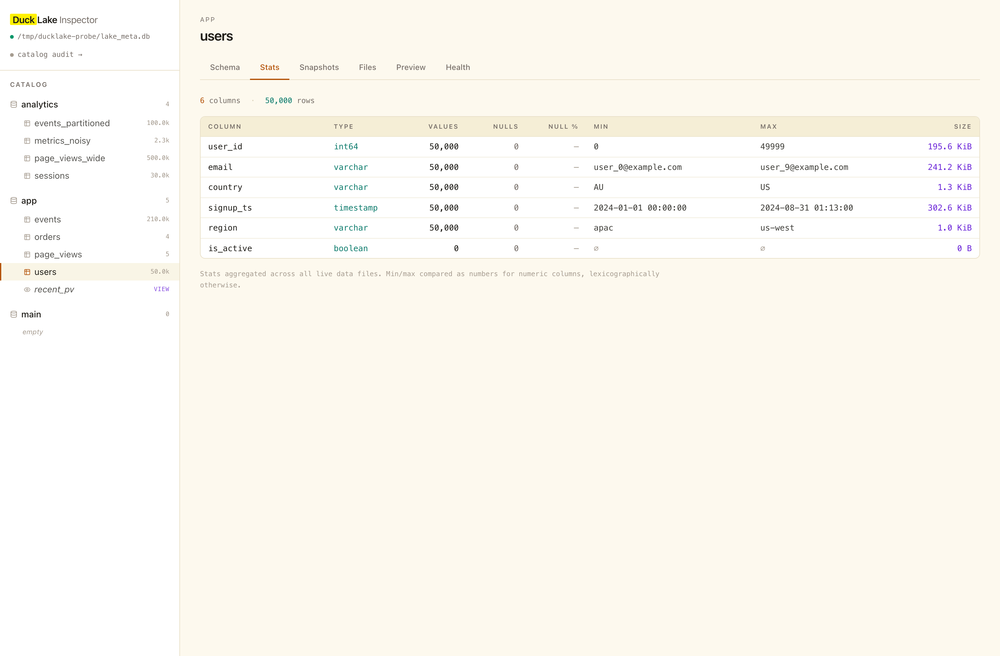
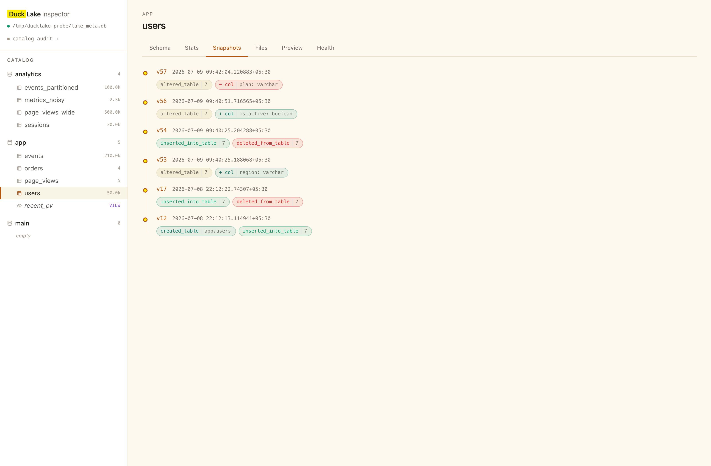

# ducklake-inspector

**A local-first browser and doctor for [DuckLake](https://ducklake.select) catalogs.**
Point it at a `lake_meta.db` file and get a read-only Next.js UI that shows every schema, table, snapshot, data file, and per-column stat — plus a `Health` tab that runs hygiene analyzers and a `/audit` page that rolls findings across the whole catalog with an optional LLM-generated executive summary.

Inspired by the `motherduck-dive-viewer` project in [motherduckdb/labs](https://github.com/motherduckdb/labs), and by the analyzer/finding pattern from [icedoc](https://github.com/prabhacloud/icedoc) (an equivalent doctor for Apache Iceberg).

---

## Screenshots

**Workspace audit — ranked findings across every table, with an AI executive summary**



**Per-table `Health` tab — analyzer findings with copy-paste remediation SQL and a compaction preview**



**`Stats` tab — per-column value/null/min/max/size aggregated from `ducklake_file_column_stats`**



**`Snapshots` tab — timeline with schema-evolution badges (`+ col`, `− col`) beside each snapshot's changes**



---

## Quick start (60 seconds)

```bash
git clone https://github.com/prabhacloud/ducklake-inspector.git
cd ducklake-inspector

# 1. Seed a demo DuckLake catalog (all 4 analyzers will fire)
duckdb < scripts/seed.sql

# 2. Configure & run
cp .env.example .env.local          # already points at /tmp/ducklake-probe/lake_meta.db
npm install
npm run dev

# Open http://localhost:3000
```

### Or run with Docker

```bash
# Seed the demo catalog first (needs duckdb CLI on host)
duckdb < scripts/seed.sql

# Then:
DUCKLAKE_HOST_DIR=/tmp/ducklake-probe docker compose up

# Open http://localhost:3000
```

Or against your own catalog:

```bash
docker run --rm \
  -v /path/to/your-lake-dir:/data:ro \
  -e DUCKLAKE_METADATA_PATH=/data/lake_meta.db \
  -p 3000:3000 \
  ducklake-inspector
```

---

## What it shows

### Per table

| Tab | What |
|---|---|
| **Schema** | Column list with types, nullability, defaults; partition spec; sort keys |
| **Stats** | Per-column value / null counts, null %, min / max (type-aware for numeric columns), on-disk size |
| **Snapshots** | Timeline of every snapshot that touched the table with parsed `changes_made` op chips *and* schema-evolution badges (`+ col name: type`, `− col name: type`) |
| **Files** | Live data files — path, format, rows, size, snapshot added |
| **Preview** | First 100 rows; `?snap=N` in the URL for time-travel preview |
| **Health** | Ranked findings from every analyzer, each with copy-paste DuckLake remediation SQL and (for small-files) a bin-packed **compaction preview** — "N files → M files" |

### Workspace-wide (`/audit`)

- Executive summary card (Claude or GPT — see [AI summary](#ai-summary))
- Aggregate finding counts by severity + est. monthly savings recoverable
- Catalog-level findings (orphan-files scan across the whole `data_path/`)
- Per-table findings ranked by worst severity, click-through to each table's `Health` tab

---

## Analyzers

Modeled on icedoc's `Finding` / `Severity` shape, ported to DuckLake's metadata surface.

| Analyzer | Detects | Reads from |
|---|---|---|
| `small-files` | Data files below target size (default 128 MiB) inflating object-store GET cost and query planning latency. | `ducklake_data_file` |
| `snapshot-bloat` | Retained snapshots past a count or age window; metadata cost + reclaim opportunity. | `ducklake_snapshot` |
| `partition-skew` | Hot partitions (>50% share) or many tiny cold partitions defeating pruning. | `ducklake_file_partition_value`, `ducklake_partition_info` |
| `orphan-files` (catalog-level) | Parquet files on disk under `data_path/` not referenced by any live or historical snapshot. | filesystem walk vs. `ducklake_data_file` ∪ `ducklake_delete_file` |

Each finding carries a severity (`low` → `critical`), title, prose detail, `remediation_sql`, structured `evidence`, and — for `small-files` — an estimated monthly $ savings and a compaction plan.

---

## AI summary

The `/audit` page can render an executive summary generated by either Claude or GPT. Set at least one key in `.env.local`:

```bash
ANTHROPIC_API_KEY=sk-ant-...
OPENAI_API_KEY=sk-...

# Optional — pick a provider explicitly. If both keys are set and this is unset,
# Anthropic wins.
LLM_PROVIDER=anthropic          # or 'openai'

# Optional — override models.
ANTHROPIC_MODEL=claude-haiku-4-5-20251001
OPENAI_MODEL=gpt-4o-mini
```

Results are cached in-memory by `(provider, model, findings-hash)`, so re-renders don't re-call the API until the findings actually change. When neither key is set, the card degrades to a placeholder explaining how to enable it.

---

## What's intentionally out of scope

- **Writes / DDL.** Read-only. `Health` and `/audit` *display* remediation SQL for copy-paste; they don't execute it.
- **Remote catalogs.** Local `.db` metadata files only for now. MotherDuck-hosted / Postgres-backed DuckLake catalogs would require re-thinking the connection layer.
- **Authentication.** Single-user local tool.

---

## How introspection works

A single in-memory DuckDB connection loads the `ducklake` extension and `ATTACH`es your catalog as `lake`. DuckLake exposes catalog metadata as the sibling schema `__ducklake_metadata_lake.main.*`; a helper in `lib/connection.ts` rewrites bare `ducklake_*` table references to the fully-qualified name so introspection queries in `lib/ducklake.ts` stay readable. Row previews and time-travel reads go through the user-visible `lake` catalog: `SELECT * FROM lake.<schema>.<table> AT (VERSION => N)`.

## Layout

```
app/
  page.tsx              # per-table view (Schema / Stats / Snapshots / Files / Preview / Health)
  audit/page.tsx        # workspace-level audit + AI summary
components/
  Sidebar.tsx           # shared left-nav shell
  CatalogTree.tsx       # schema → table/view list
  Tabs.tsx              # per-table tab bar
  SchemaPane.tsx        # column / partition / sort-key layout
  StatsPane.tsx         # per-column stats table
  SnapshotsPane.tsx     # snapshot timeline with schema-evolution badges
  FilesPane.tsx         # live data-file table
  PreviewPane.tsx       # row preview (with time travel)
  HealthPane.tsx        # analyzer findings + compaction preview
lib/
  connection.ts         # DuckDB bootstrap, catalog attach, meta-query rewrite
  ducklake.ts           # introspection queries (schemas, tables, columns, files, snapshots, stats)
  analyzers.ts          # small-files / snapshot-bloat / partition-skew / orphan-files + Finding model
  llm.ts                # Anthropic + OpenAI executive-summary generator, with prompt caching
scripts/
  seed.sql              # one-command demo catalog seed
docs/screenshots/       # README hero images
```

## Development notes

- **Don't run `npm run build` while `npm run dev` is running.** They share `.next/` and prod build clobbers the dev bundle, leaving the dev server serving 404s for CSS/JS chunks. If it happens: `rm -rf .next && npm run dev`.
- The dev server calls `process.chdir()` at bootstrap so DuckLake can resolve relative `data_path` values, then restores CWD in a `finally` block. Tailwind's `content` globs use absolute paths (see `tailwind.config.js`) as a defense-in-depth so CSS still generates if that restore ever fails.

## License

MIT — see [LICENSE](LICENSE).
